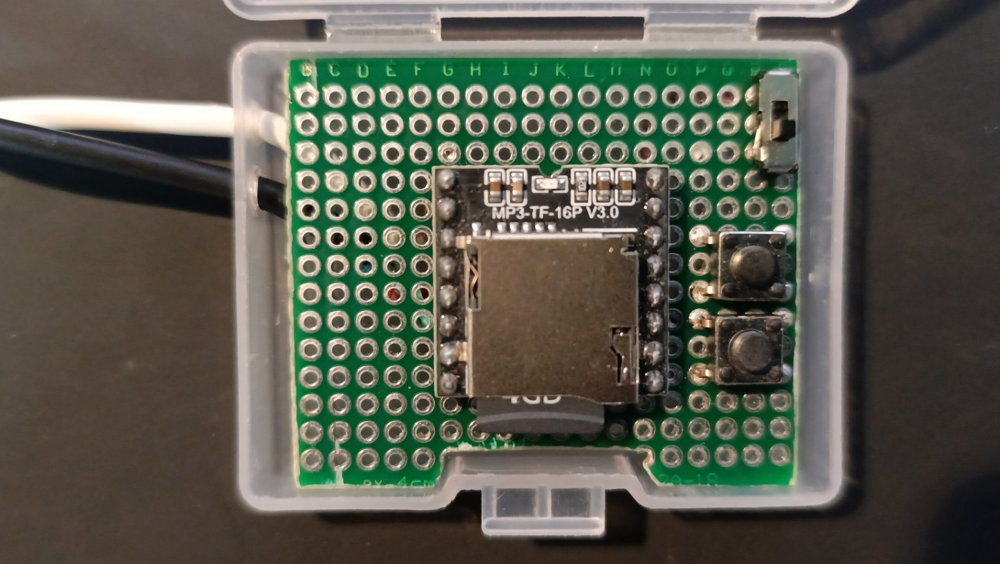

# Guide d'utilisation – DFPlayer Mini (MP3-TF-16P V3.0)

Ce projet utilise un module **DFPlayer Mini** monté sur une plaque à pastilles, avec quelques boutons et interrupteurs permettant de contrôler la lecture audio directement.



---

## Matériel

- Module **DFPlayer Mini (MP3-TF-16P V3.0)**
- Carte microSD (formatée en FAT32, contenant les fichiers `.mp3` ou `.wav`)
- 2 boutons-poussoirs (IO1 et IO2)
- 1 interrupteur (lecture automatique au démarrage)
- Câble **USB (blanc)** → alimentation 5V
- Câble **jack (noir)** → sortie audio vers ampli (utilisation de la sortie DAC)
- Boîtier plastique de protection

---

## Schéma des commandes

- **Interrupteur (en haut à droite)**  
  Active ou désactive la **lecture automatique** au démarrage.  
  - `ON` : joue automatiquement la première piste au démarrage.  
  - `OFF` : reste en attente d’une action manuelle.

- **Boutons (à droite)**  
  - **IO1 (bas à droite)** : Bouton 1  
    - Fonction par défaut : **lecture de la piste suivante**  
  - **IO2 (haut à droite)** : Bouton 2  
    - Fonction par défaut : **lecture de la piste précédente**

- **USB (blanc)** : alimentation 5V.  
- **Jack (noir)** : sortie audio stéréo (via DAC) vers un ampli ou casque.

---

## Préparation de la carte SD

1. Formater la carte microSD en **FAT32**.  
2. Copier les fichiers audio (`.mp3` ou `.wav`) sur la carte.  
   - Les fichiers doivent être nommés `0001.mp3`, `0002.mp3`, etc. pour assurer une lecture correcte.  
3. Insérer la carte microSD dans le DFPlayer Mini.  

---

## Fonctionnement

1. Brancher le câble **USB blanc** pour alimenter le module.  
2. Si l’interrupteur **Lecture auto** est activé → la première piste démarre automatiquement.  
3. Utiliser les boutons :  
   - **IO1 (bas)** : piste suivante  
   - **IO2 (haut)** : piste précédente  
4. Le son sort via la **prise jack noire**, connectée à l’ampli.

---

## Notes

- Le module supporte des cartes microSD jusqu’à **32 Go**.  
- Les fichiers doivent être encodés en **MP3 ou WAV** standards.  
- Les boutons peuvent être reconfigurés via les broches **ADKEY1/ADKEY2** si besoin.  
- Pour un meilleur son, il est recommandé de passer par un ampli externe via la sortie DAC (déjà utilisée ici).  

---

## Exemple d’utilisation

1. Charger une carte microSD avec 3 fichiers :  
   - `0001.mp3` → son d’accueil  
   - `0002.mp3` → musique 1  
   - `0003.mp3` → musique 2  

2. Mettre l’interrupteur sur `ON`.  
   - Au démarrage, `0001.mp3` est joué automatiquement.  

3. Appuyer sur **IO1 (bas)** pour passer à `0002.mp3`.  
4. Appuyer sur **IO2 (haut)** pour revenir à `0001.mp3`.  

---

## Dépannage

- **Pas de son** :  
  - Vérifier que la carte SD est bien insérée et formatée en FAT32.  
  - Vérifier l’alimentation 5V.  
  - Vérifier la connexion jack vers l’ampli.  

- **Lecture dans le désordre** :  
  - Renommer les fichiers en respectant le format `0001.mp3`, `0002.mp3`, etc.  

---

## Schéma de câblage (ASCII)

```

          ┌───────────────────── DFPlayer Mini (MP3-TF-16P v3.0) ─────────────────────┐
          │                                                                           │
 USB 5V ──┤ VCC                                                                   GND ├───┐
  (blanc) │                                                                           │   │
          │ DAC_L ────────────────┐                                        IO2 ──┐   │   │
          │                       │                                       (BTN2) │   │   │
          │ DAC_R ───────────┐    ├───► Vers prise JACK noire (sortie DAC)      │   │   │
          │                  │    │                                             │   │   │
          │ GND ─────────────┴────┴─────────────────────────────────────────────┴───┴───┘
          │                                                                           ▲
          │ IO1 ──┐ (BTN1)                                                            │
          │       └────── Bouton vers GND (piste suivante)                            │
          │                                                                           │
          │ IO2 ──┐ (BTN2)                                                            │
          │       └────── Bouton vers GND (piste précédente)                          │
          │                                                                           │
          │ AUTO_SW ──┐                                                               │
          │           └── Interrupteur ► GND  →  **Lecture automatique au démarrage** │
          └───────────────────────────────────────────────────────────────────────────┘
```

 Légende prise JACK (noir) — sortie ligne (DAC) :
   • Pointe (Tip)  = DAC_L
   • Anneau (Ring) = DAC_R
   • Manchon (Sleeve) = GND

 Remarques :
   • Les entrées IO1/IO2 du DFPlayer ont un pull-up interne → appui = mise à la masse (GND).
   • L’interrupteur « AUTO_SW » met à la masse l’entrée prévue pour l’autostart : en position ON,
     le module lance la lecture au power-up (comportement que tu constates sur ton montage).


✍️ Auteur : *Eric*  
📅 Version : 1.0
